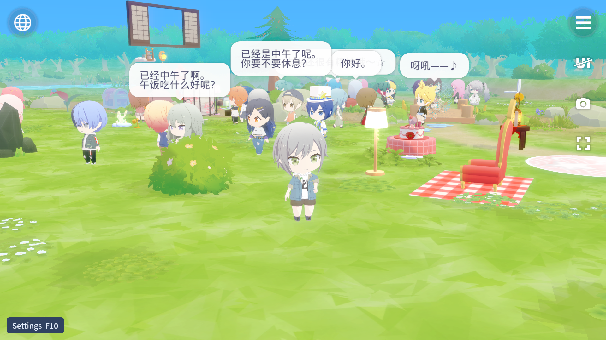

# moly

MYSEKAI的还原项目，使用 Rust 与 [Bevy](https://bevyengine.org/) 构建，
支持原生程序和浏览器（WebAssembly）。

目标是还原场景探索、角色行为、家具互动与天气表现。**项目仍在开发中**



## 资源

运行所需的模型、贴图、动作和音频由使用者自行提供，不随仓库分发。
项目代码与游戏资源的权利归属相互独立。

## 对话与互动

在原生程序中按 **F9** 打开“对话与互动”。默认的 **独立体验** 会前往一处
临时空场景，只布置所选内容确实需要的角色与源资源家具；结束、关闭或失败后
返回原场景并恢复布局、名册、玩家与相机。**当前场景** 则只使用眼前已经存在
的角色和家具，不会自动补齐。没有角色动作的陈设家具在独立体验中用于查看，
不会被描述或派发成互动。

资源根是不可混合的区服快照。界面显示当前 `region` 与 `gameVersion`；CN、JP
相同数字 ID 不会跨资源根合并。家具只有在主表的资源叶名、导出包和 fixture
视图相互一致时才进入临时布置。墙纸、地板等纯外观条目仍可浏览，但不会被
伪装成独立的落地模型。

## 本地运行

安装稳定版 Rust 和 Node.js 22，将 `MOLY_ASSET_ROOT` 指向已提取的资源目录，
运行 `cargo run --release -p moly-app`。构建默认写入仓库的 `target/`；需要共享缓存时，
自行设置 `CARGO_TARGET_DIR`，增量编译可通过 `CARGO_INCREMENTAL` 配置。

浏览器版需要 `wasm32-unknown-unknown` target 和与 Cargo.lock 一致的 wasm-bindgen CLI：

```sh
rustup target add wasm32-unknown-unknown
cargo install wasm-bindgen-cli --version 0.2.127 --locked
node web/build-wasm.mjs
node web/serve.mjs
```

打开开发服务器给出的 `?assets=/assets/` 地址。启动页先检查图形支持，点击开始时启用音频。
构建脚本分别生成 `web/pkg/webgpu/` 和 `web/pkg/webgl2/`，页面只下载所选后端的模块。
WebGPU 不可用时会选择 WebGL2；启动失败页可重新加载，或用 `?renderer=webgl2` 重试。
每次重试都会重新加载页面。浏览器同时只允许一个页面写入存档，其余页面可浏览；
关闭可写页面后，重新加载其他页面可申请写入权限。不支持 Web Locks 的环境保持只读。

开发服务器只监听回环地址。资源目录应可信且只读，目录内链接的实际目标必须仍在同一挂载根内。
分包模式（`?packs=1`）限制目录/清单为 16 MiB、单 blob 为 128 MiB、单个解码资产为
256 MiB（分包载荷），解压大小最多为 blob 大小的 256 倍加 64 KiB。最多同时读取 8 份资源，传输与解码
缓冲合计预算为 512 MiB。浏览器分包响应逐块读取，超限或超时即中止；这些预算不包含
加载器已经接收的数据、解析后的目录、资源及场景对象、GPU 资源和浏览器内部缓存。
暂时的预算不足会按请求顺序等待，取消读取会释放排队和已占用的预算；单个请求超过上限时
直接拒绝。identity 数据只预留传输缓冲，gzip 同时预留传输与解码缓冲。分包读取器按顺序
消费，读完或丢弃时释放读取预算；需要 seek 的自定义加载器可使用 Bevy 的 VecReader 回退。

## 玩家数据导入

打开 **Settings（F10）→ Player data**，选择与资源一致的区服，输入 UID 并点击
**Fetch player**，或使用 **Choose JSON** 读取玩家数据。确认预览后点击
**Import preview**，即可加载家具布局、配色及等级对应的场地大小。
原生程序也支持拖入 JSON 文件。支持原始 Home 响应及 `updatedResources` 包装。
导入后会进入对应场景，重启时默认打开已导入的主页；显式站点参数仍可覆盖启动位置。

导入保留一份原布局备份，**Restore backup** 可以恢复；音量、画质及其他设置保持原值。
有未保存的家具编辑、数据无效或资源不匹配时不会覆盖存档。自定义图片、饰件和墙纸地板
记录会保留，但这些外观的渲染尚未接入。

JSON 输入上限为 32 MiB。UID 请求和文件选择使用受限流式读取；浏览器先检查文件大小，
再打开读取流。同一应用进程同时只读取一份导入正文，取消会中止正在读取的请求或文件，
迟到结果不会进入预览。超限、取消或读取失败均不修改当前布局和存档。

资源根需要提供 `fixture-models/player-data.json` 和其中引用的配色贴图。该目录包含
区服及家具、场地、等级解锁主表，不含玩家数据。各区服需使用对应的主表和模型资源。

原生默认从 `https://haruki-api.menardi.top/api/{region}/mysekai/{target_user_id}` 获取数据。
可通过 `MOLY_PLAYER_API` 覆盖 URL 模板，`MOLY_PLAYER_REGION` 选择 `cn` 或 `jp`。
`MOLY_PLAYER_UID` 在启动时获取并预览数据；`MOLY_PLAYER_DATA_FILE` 在启动时导入指定 JSON。
UID 与文件启动参数只能选择一种。

浏览器版使用同源 `/player-api/{region}/{target_user_id}`，开发服务器 `web/serve.mjs`
已包含转发。使用 Cloudflare 静态资源绑定时，可使用 `web/player-api-worker.mjs`。
页面参数 `player_uid`、`player_region`、`player_api` 可覆盖获取输入。

## 版本与 CI

版本统一定义在 `Cargo.toml` 的 `[workspace.package]` 中，所有 crate 继承该版本。
设置面板显示当前版本；原生程序可通过 `moly-app --version` 查询，无需加载资源。

GitHub Actions 在推送、拉取请求和手动触发时执行版本一致性、JavaScript 语法、
开源边界及提交空白检查。CI 不编译、不打包，也不需要游戏资源。
版本和边界检查可在本地运行 `python tools/version/check.py`、`node tools/boundary/check.mjs`。
本地无 GPU 的核心与回归测试可运行 `cargo test --release --workspace --lib -- --test-threads=1`，
其中的网络和存档检查使用回环服务、合成输入及临时文件，不需要游戏资源。

## 代码结构

| 目录 | 职责 |
|---|---|
| `crates/moly-law` | 不依赖引擎的行为与计算逻辑 |
| `crates/moly-assets` | 资源目录、资源包与数据加载 |
| `crates/moly-game` | 场景、交互、UI 与渲染 |
| `crates/moly-app` | 原生与浏览器入口 |
| `web` | 浏览器页面与构建工具 |
| `tools` | 仓库边界与渲染顺序检查 |
| `screenshots/readme.png` | README 展示图 |

## 许可

代码采用 [AGPL-3.0-only](LICENSE)。第三方内容按各自许可证分发，见
[THIRD_PARTY_NOTICES.md](THIRD_PARTY_NOTICES.md)。代码许可证不授予游戏资源的使用或分发权。
